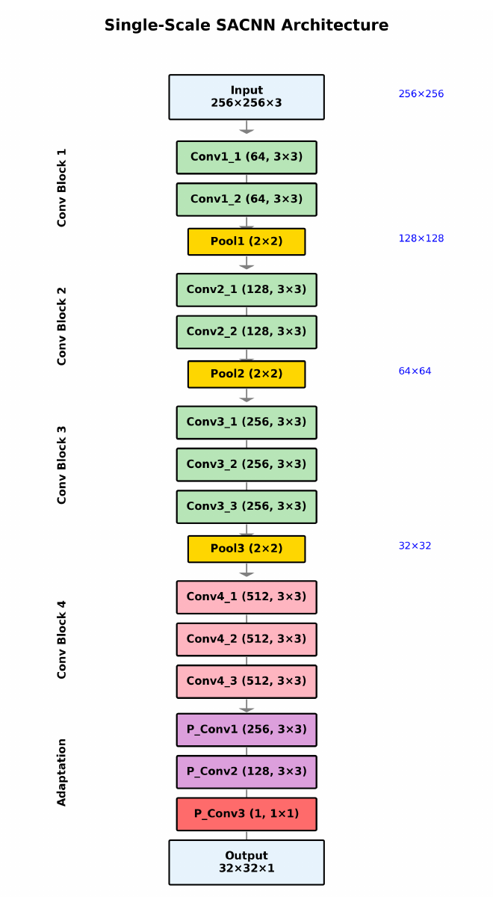
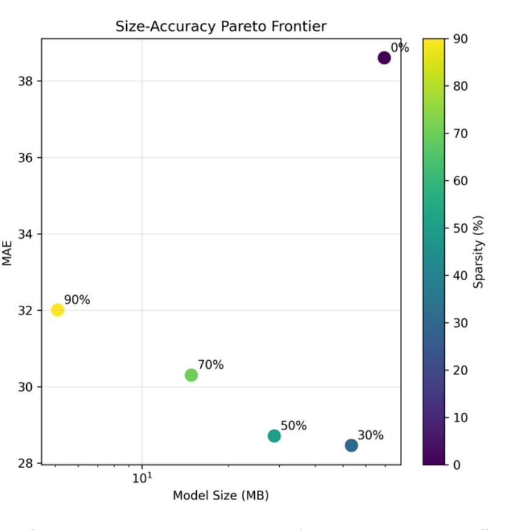
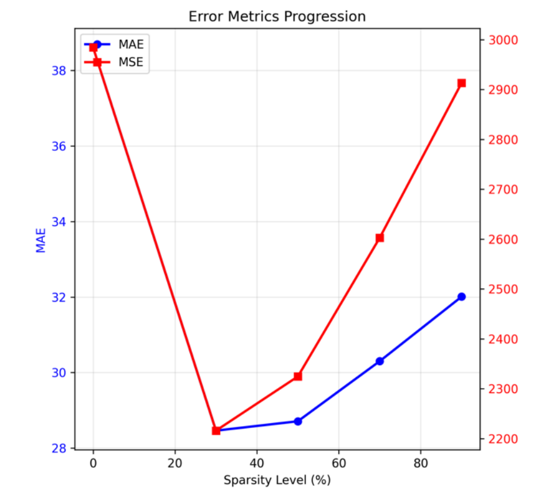

# Deep Learning at the Edge: Model Compression for Microcontroller-Based Crowd Counting

A compressed convolutional neural network for crowd counting, built and evaluated
for deployment on resource-constrained embedded hardware. The project takes a
Single-Scale SaCNN (Scale-Adaptive Crowd Counting Neural Network) through a full
edge-optimization pipeline -- training, structured magnitude pruning, and INT8
quantization -- and then characterizes the hardware actually required to run it on
a microcontroller.

This repository accompanies the MSc dissertation *"Deep Learning at the Edge:
Model Compression for Microcontroller-Based Crowd Counting"* (MSc Artificial
Intelligence and Adaptive Systems, University of Sussex, 2025).

<p align="center">
  
</p>

*Single-Scale SaCNN architecture: four convolutional blocks followed by feature
adaptation layers. A 256x256x3 RGB image is mapped to a 32x32 density map whose sum
is the crowd count.*



*Size-accuracy trade-off across sparsity levels. The 70% point sits on the efficient
frontier (7.0x compression at MAE 30.3); all pruned models beat the unpruned baseline.*

---

## Key Findings

- **Activation memory, not model file size, is the binding deployment constraint.**
  The fully compressed model is only 440 KB on disk, but the ~4.1 MB runtime
  (activation) memory requirement exceeds the SRAM of standard microcontrollers,
  including the Raspberry Pi Pico (264 KB) and Teensy 4.0 (1 MB). Only platforms
  with external PSRAM expansion are viable.
- **79x overall compression.** The combined pruning + INT8 pipeline reduces the
  model from ~70 MB to 440 KB.
- **Pruning improves on the baseline.** Because the 9.8M-parameter baseline is
  overparameterized for ShanghaiTech Part B, structured pruning acts as a
  regularizer: every pruned configuration achieves a lower MAE than the unpruned
  model (baseline 38.6 to as low as 28.8 at 50% sparsity).
- **70% sparsity is the Pareto-optimal pruning point**, giving 7.0x compression at
  MAE 30.3.
- **INT8 quantization can fail catastrophically.** At 70% sparsity, full INT8
  quantization produced an MAE of 128.56 ("variance collapse"), while every other
  sparsity level quantized cleanly -- indicating the failure is tied to the
  specific pruning pattern rather than sparsity alone.

---

## Results (ShanghaiTech Part B)

Metric is Mean Absolute Error (MAE) on the test set -- lower is better.

### Structured Pruning

| Sparsity | MAE  | MSE    | Parameters | Size (MB) | Compression |
| -------- | ---- | ------ | ---------- | --------- | ----------- |
| 0%       | 38.6 | 2345.2 | 9.8M       | 70.0      | 1.0x        |
| 30%      | 31.0 | 2520.5 | 7.0M       | 38.0      | 1.8x        |
| 50%      | 28.8 | 2195.3 | 4.9M       | 31.0      | 3.6x        |
| 70%      | 30.3 | 2456.3 | 2.5M       | 10.0      | 7.0x        |
| 90%      | 32.0 | 2890.1 | 0.95M      | 5.0       | 20.6x       |



*Error metrics across sparsity. Left axis: MAE (blue); right axis: MSE (red). Both
dip below the baseline before rising again, the signature of pruning relieving
overparameterization.*

### Quantization (INT8)

| Sparsity | Float32 MAE | INT8 MAE | INT8 Size (MB) |
| -------- | ----------- | -------- | -------------- |
| Baseline | 44.00       | 43.51    | 8.78           |
| 30%      | 29.43       | 29.34    | 4.51           |
| 50%      | 30.51       | 30.64    | 2.45           |
| 70%      | 32.20       | 128.56   | 1.27           |
| 90%      | 34.80       | 34.91    | 0.44           |

The 90% pruned + INT8 model is the final deployment candidate: 440 KB, MAE 34.91,
a 79x reduction from the original.

INT8 quantization is near-lossless at most sparsity levels -- the INT8 MAE tracks
the float32 MAE to within a fraction of a point at baseline, 30%, 50%, and 90%. The
one exception is 70% sparsity, where INT8 quantization fails catastrophically: MAE
jumps from 32.20 (float32) to 128.56, a 299% increase. The model produces no usable
density map and predicts near-zero counts. A per-layer variance analysis attributes
this to "variance collapse" -- the specific 70% pruning pattern leaves certain layers
with an activation distribution too narrow to survive 8-bit requantization. Notably,
the more aggressively pruned 90% model does *not* collapse, which indicates the
failure is tied to the particular pruning pattern rather than to sparsity alone.

---

## Repository Structure

```
Deep-Learning-at-the-Edge/
├── config/
│   └── single_scale_config.py     # CONFIG object: paths, hyperparameters, paper targets, EDGE_DEPLOYMENT flag
├── data/
│   └── simple_loader.py           # SimpleDataLoader, create_train_val_datasets
├── models/
│   ├── single_scale_vgg.py        # SingleScaleSACNN (VGG backbone); used when EDGE_DEPLOYMENT=False
│   ├── single_scale_edge.py       # Edge-oriented variant; used when EDGE_DEPLOYMENT=True
│   └── losses.py                  # euclidean_loss, relative_count_loss, mae/mse/rmse metrics
├── training/
│   └── train_single_scale.py      # SingleScaleTrainer / run_training
├── utils/                         # Helper utilities
├── docs/
│   └── figures/                   # Figures used in this README (from the dissertation)
├── new_main2.py                   # Main CLI entry point (train / test / info)
├── dataset_preprocessing.py       # ShanghaiTech Part B preprocessing (256x256 RGB + 32x32 density maps)
├── tflite_prune.py                # Structured magnitude pruning (CLI)
├── Quantization_code.py           # Post-training INT8 quantization
├── evaluate_quantized_models.py   # Evaluation of .tflite models (CLI)
├── visualization_code.py          # Density-map visualizations for INT8 models (CLI)
└── requirements.txt
```

---

## Installation

Requires Python 3.10 (matching the pinned TensorFlow 2.15 stack).

```bash
git clone https://github.com/MrShark543/Deep-Learning-at-the-Edge.git
cd Deep-Learning-at-the-Edge

python -m venv .venv
source .venv/bin/activate        # On Windows: .venv\Scripts\activate

pip install -r requirements.txt
```

Core dependencies: TensorFlow 2.15, TensorFlow Model Optimization 0.7.5, NumPy,
OpenCV, SciPy, Pillow, h5py, matplotlib, seaborn, pandas, scikit-learn, tqdm.

---

## Dataset & Preprocessing

This project uses **ShanghaiTech Part B**. Annotations are MATLAB `.mat` files
loaded with `scipy.io`.

1. Download ShanghaiTech and arrange the raw data so the preprocessor can find it:

```
datasets/shanghaitech/part_B_final/
├── train_data/
│   ├── images/          # IMG_*.jpg
│   └── ground_truth/    # GT_IMG_*.mat
└── test_data/
    ├── images/
    └── ground_truth/
```

2. Run preprocessing (no arguments; source/target paths are set inside the script):

```bash
python dataset_preprocessing.py
```

This pads and resizes every image to 256x256 RGB, generates fixed-sigma 32x32
density maps (1/8 input resolution, normalized to preserve count), and writes the
result to `datasets/shanghaitech_256x256_rgb/part_B/`. It also runs a verification
pass and a train/test leakage check (expects 400 train / 316 test images).

---

## Usage

### 1. Train the baseline

The main entry point is `new_main2.py` (`train` / `test` / `info` subcommands). The
model architecture is selected automatically from the `CONFIG.EDGE_DEPLOYMENT` flag
in `config/single_scale_config.py`.

```bash
# Train on Part B
python new_main2.py train --part B

# Fixed epoch count and a named experiment
python new_main2.py train --part B --epochs 100 --name baseline_run

# Quick smoke test
python new_main2.py train --part B --quick
```

| Flag       | Description                                         | Default |
| ---------- | --------------------------------------------------- | ------- |
| `--part`   | Dataset part: `A`, `B`, or `mixed`                  | `A`     |
| `--epochs` | Number of training epochs                           | config  |
| `--quick`  | Quick test with few epochs                          | off     |
| `--name`   | Experiment name (used for the output directory)     | none    |

Trained models are saved as `best_model.h5` in the experiment directory printed at
the end of the run.

### 2. Test a trained model

```bash
python new_main2.py test --model path/to/best_model.h5 --part B
```

Loads the `.h5` model with its custom losses/metrics, evaluates on the test split,
and compares the MAE against `CONFIG.PAPER_TARGETS`.

### 3. Inspect dataset / model

```bash
python new_main2.py info --dataset    # dataset statistics
python new_main2.py info --model      # model summary, parameter count, float32 size
```

---

## Edge Optimization Pipeline

### Step 1 -- Structured pruning

`tflite_prune.py` applies global structured magnitude pruning (filters ranked by
L2 norm, weighted by per-layer importance) and fine-tunes each pruned model.

```bash
python tflite_prune.py --model path/to/best_model.h5 --part B --sparsity 0.3,0.5,0.7,0.9 --name pruning_run
```

| Flag         | Description                                   | Default             |
| ------------ | --------------------------------------------- | ------------------- |
| `--model`    | Path to the trained baseline (required)       | --                  |
| `--part`     | Dataset part: `A`, `B`, or `mixed`            | `B`                 |
| `--sparsity` | Comma-separated sparsity levels               | `0.3,0.5,0.7,0.9`   |
| `--name`     | Experiment name                               | timestamped         |

Outputs pruned `.h5` models, a results table (CSV / LaTeX / TXT), and analysis
plots to `./pruned_models/<experiment>/`.

### Step 2 -- INT8 quantization

`Quantization_code.py` converts the baseline and pruned models to TensorFlow Lite
INT8 using representative calibration data. Model paths are set inside `main()` --
edit `SAVED_MODELS_DIR` and `PRUNED_MODELS_DIR` to point at your trained/pruned
models, then run:

```bash
python Quantization_code.py
```

Outputs `.tflite` files to `./quantization_results/<experiment>/`.

Notes:
- As committed, only the `int8_full` method is enabled; the float16 / dynamic-range
  / hybrid methods are present but commented out in the `methods` list.
- INT8 outputs are dequantized as `(output - zero_point) * scale` before being
  compared to the float ground-truth counts; comparing raw integer outputs directly
  produces meaningless error figures.
- Evaluation can be slow and may give incorrect results on Windows; the quantization
  conversion itself runs fine on any platform.

### Step 3 -- Evaluate the quantized models

`evaluate_quantized_models.py` runs every `.tflite` model in a directory against a
precomputed test set stored as an `.npz` file (with `images` and `counts` arrays).

```bash
python evaluate_quantized_models.py --models_dir ./quantization_results/<experiment> --test_data path/to/test_data.npz
```

Produces a JSON summary plus comparison plots (MAE by pruning x quantization, size
heatmap, Pareto frontier) in `<models_dir>/evaluation_results/`.

### Step 4 -- Visualize density maps

`visualization_code.py` renders input image, ground-truth density map, predicted
density map, and a count comparison for the INT8 models.

```bash
python visualization_code.py --models_dir ./quantization_results/<experiment> --test_data path/to/test_data.npz --samples 0 1 2
```

| Flag          | Description                                | Default   |
| ------------- | ------------------------------------------ | --------- |
| `--models_dir`| Directory of `.tflite` models (required)   | --        |
| `--test_data` | `.npz` test data file (required)           | --        |
| `--samples`   | Sample indices to visualize                | `0 1 2`   |
| `--verbose`   | Print per-model inference errors           | off       |

---

## Hardware Feasibility

| Platform           | SRAM            | Verdict for this model                          |
| ------------------ | --------------- | ----------------------------------------------- |
| Raspberry Pi Pico  | 264 KB          | Infeasible (activation memory far exceeds SRAM) |
| Teensy 4.0         | 1 MB            | Infeasible (~4.1 MB activation memory needed)   |
| Teensy 4.1 + PSRAM | 1 MB + up to 8 MB PSRAM | Minimum viable (PSRAM adds latency)     |
| ESP32-S3           | 512 KB + up to 8 MB PSRAM | Viable with external PSRAM            |

The 440 KB model file fits easily in flash on all of these; it is the intermediate
activation tensors that cannot be accommodated without external memory.

---

## Notes and Limitations

- `dataset_preprocessing.py` and `Quantization_code.py` use hardcoded paths (no
  CLI); edit the paths inside each script before running.
- The baseline was trained on GPU (Kaggle, T4 x2); pruning and quantization were
  run locally.
- Known issue: in `data/simple_loader.py` the validation split is currently drawn
  from the full training set rather than a properly held-out subset.

---

## References

- L. Zhang, M. Shi, and Q. Chen. "Crowd Counting via Scale-Adaptive Convolutional
  Neural Network." *IEEE Winter Conference on Applications of Computer Vision
  (WACV)*, 2018, pp. 1113-1121. (SaCNN -- the base architecture.) arXiv:1711.04433
- Y. Zhang, D. Zhou, S. Chen, S. Gao, and Y. Ma. "Single-Image Crowd Counting via
  Multi-Column Convolutional Neural Network." *IEEE Conference on Computer Vision
  and Pattern Recognition (CVPR)*, 2016, pp. 589-597. (Introduces the ShanghaiTech
  dataset.)
- L. Bai et al. "Fuss-Free Network: A Simplified and Efficient Neural Network for
  Crowd Counting." 2024. arXiv:2404.07847 (FFNet.)
